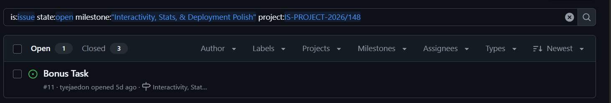
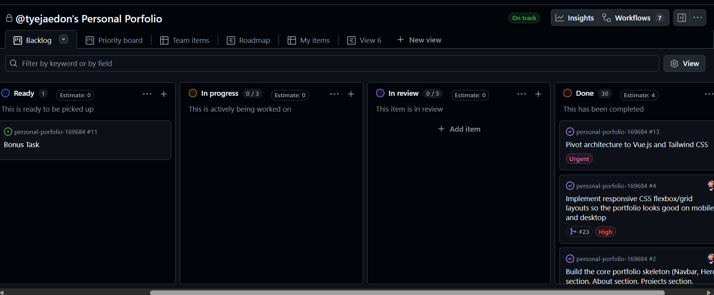
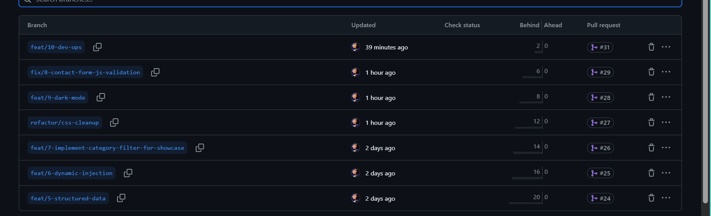
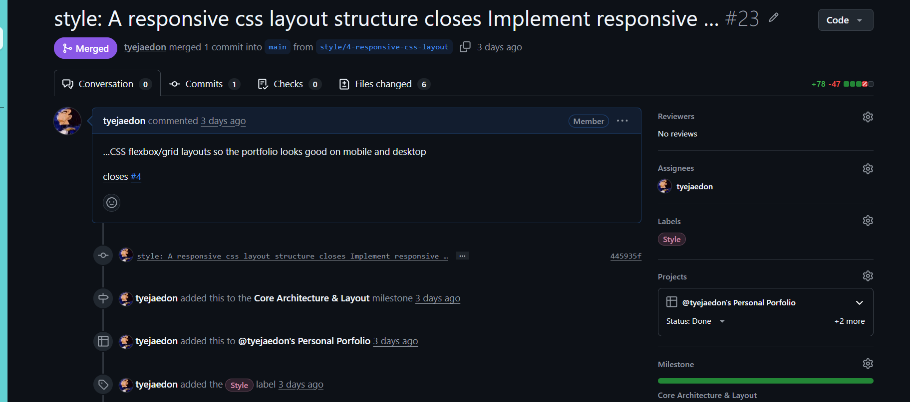
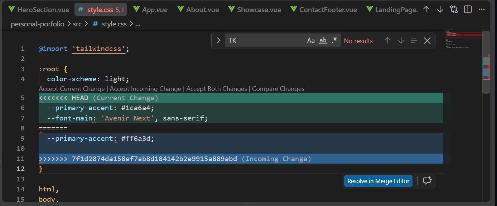
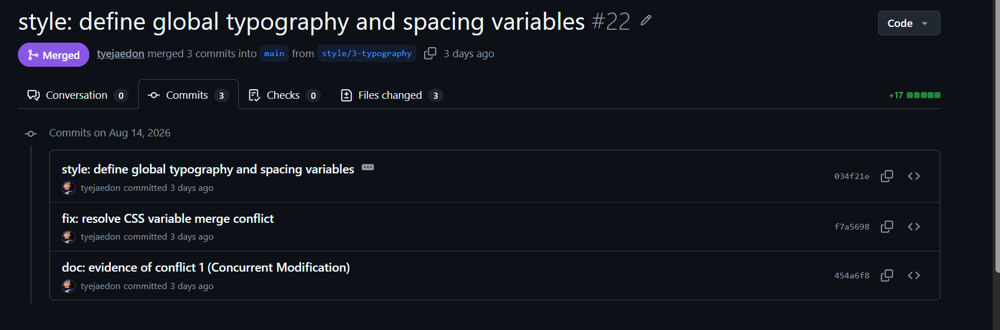
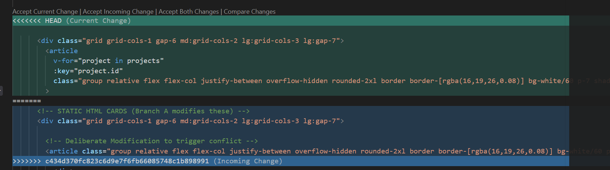
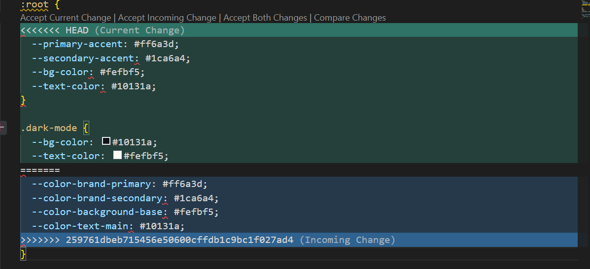

# Project Submission Report

## 1. Student Details

- Full Name: Jaedon Jeremiel Munyua
- GitHub Username: tyejaedon
- Email: jaedon.munyua@strathmore.edu

## 2. Deployed Project Link

- Live GitHub Pages URL: https://is-project-2026.github.io/personal-porfolio-169684/

## 3. Reflection - Grounded in Your Git History

**Rules:** Every answer below must include a direct link to the specific commit, PR, issue, or branch in your repository that demonstrates what you are describing. Answers without working links will not be graded. Generic explanations that could apply to any project will receive zero marks.

**Marks:** A (2 marks) - B (1 mark) - C (1 mark) - D (1 mark) = 5 marks total

### A. Your Best Commit

- Commit URL: https://github.com/IS-PROJECT-2026/personal-porfolio-169684/commit/bd737262b204235ba710f93a56eac6f19039136e

- Why this one? This commit perfectly follows the Conventional Commits specification by using the correct type prefix (feat:), keeping the subject line concise in the imperative voice, and including a structured footer (e.g., Closes #2) to ensure automated traceability back to my Kanban board.

### B. A Mistake or Struggle

- Link to the evidence: https://github.com/IS-PROJECT-2026/personal-porfolio-169684/commit/c31b5061457a8ae843744126c7e7c6e514ddb5ae

- What happened and how did you recover? My GitHub Actions deployment failed with a "Dependencies lock file is not found" error because my package.json and workflow were out of sync, and I was receiving Node 20 deprecation warnings. I recovered by running npm install locally to generate the missing package-lock.json, committing it to the repository, and updating my .github/workflows/deploy-vite.yml file to run on Node 24.

### C. A Pull Request You're Proud Of

- PR URL: https://github.com/IS-PROJECT-2026/personal-porfolio-169684/pull/25

- What did you check before merging? Before merging, I verified that the Vue v-for loop successfully replaced the static HTML, dynamically rendering my 14 GitHub repositories from the structured data array. I also ensured the PR description properly used the "Fixes/Closes" keyword to automatically transition Issue #6 to "Done" on the project board.

### D. One Thing You Would Do Differently

- What would you change? I would initialize the Vue/Vite frontend directly in the root directory from the very beginning. Early on, I accidentally nested the Vue project inside a subfolder (/personal-porfolio/), which complicated the GitHub Actions CI/CD deployment paths and required structural fixes.
- Link to the evidence of the original decision: https://github.com/IS-PROJECT-2026/personal-porfolio-169684/commit/991a64b6caf387870994facd6d89ece1a3fa16f9

## 4. Screenshots of Key GitHub Features

Demonstrate your workflow mechanics by embedding your screenshots below.

**CRITICAL FOR WORKING IMAGES:** Do not type manual folder paths. Edit this file directly on the GitHub web interface, click on the blank line below each prompt, and paste (Ctrl+V / Cmd+V) your screenshot. GitHub will automatically upload the file and generate a permanent, working image link for you.

### A. Milestones and Issues

Provide a screenshot showing your active milestone(s) and the granular tracking issues linked directly to them.

Caption: This shows screenshot shows the active milestone Interactivity, Stats, & Deployment Polish with the issue  Bonus Task active with 3 closed issues under that milestone

### B. Project Board

Provide a screenshot of your GitHub Project Board with your issues organized dynamically across columns (To Do, In Progress, Done).

Caption: My Kanban board showcases the backlog at the end of production showing 30 issues closed with one open. Below is the burn up charting showing the agile progress during devleopment

### C. Branching Architecture

Caption: This displays my feature branching architecture, strictly adhering to conventional prefixes and issue numbers (e.g., feat/6-dynamic-injection).

### D. Pull Requests and Traceability

Provide a screenshot of a completed or open Pull Request (PR) on GitHub that clearly shows it is linked to a related development issue.

Caption: A completed Pull Request demonstrating traceability by automatically closing its associated Kanban issue upon merging into main.

## 5. Merge Conflict Evidence

You must engineer three merge conflicts, each triggered by a different cause from those covered in the lecture. For Conflict 1, document the full resolution lifecycle. For Conflicts 2 and 3, provide the conflict marker screenshot and identify the cause.

**Marks:** Conflict 1 full chronology (2 marks) - Conflict 2 (1 mark) - Conflict 3 (1 mark) - All three use distinct causes (1 mark) = 5 marks total

### Conflict 1 - Full Chronology

- What cause did you use? Concurrent Modification (Same Line)

#### Step 1: Generating the Clash

Screenshot showing the merge attempt and the conflict warning.

Caption: This shows the collision between the style/3-color-palette and style/3-typography branches when attempting to merge both into main.

#### Step 2: Inside the Code Editor (Conflict Markers)

Screenshot showing the raw, unresolved conflict markers (<<<<<<< HEAD, =======, >>>>>>>) in your editor.

Caption: Git flagged a conflict on Line 2 of src/style.css because both branches attempted to add distinct CSS variables to the exact same root selector line.

#### Step 3: Resolution and Clean Merge

Screenshot of your clean Git history or completed PR showing the conflict was resolved and merged.

Caption: The conflict was resolved manually by preserving both the color and typography variables within the final block before committing the resolution.

### Conflict 2 - Different Cause

- What cause did you use? Modify vs. Delete
- Why does this cause trigger a conflict? This conflict occurred because feat/5-structured-data actively modified static HTML elements within the project showcase, while a subsequent PR from feat/6-dynamic-injection completely deleted those exact same lines to replace them with a dynamic Vue v-for loop. Git halted the merge because it could not determine if the new text modifications should be preserved or if the deletion should completely override them.

Caption: Conflict markers in ProjectShowcase.vue demonstrating the collision between the modified static HTML block and the incoming deletion/replacement loop.

### Conflict 3 - Different Cause

- What cause did you use? Stale Branch (Divergent Refactoring)
- Why does this cause trigger a conflict? The feat/dark-mode branch was created early to implement theme styles based on the original CSS variable names. Meanwhile, a separate refactor/css-cleanup branch successfully renamed all foundational CSS variables on the main branch. When the stale dark mode branch eventually tried to merge, its code collided with main because the original variable names it relied upon had been completely replaced.

Caption: Conflict markers highlighting the clash between the old variable nomenclature used in the stale feature branch and the newly refactored base code on main.